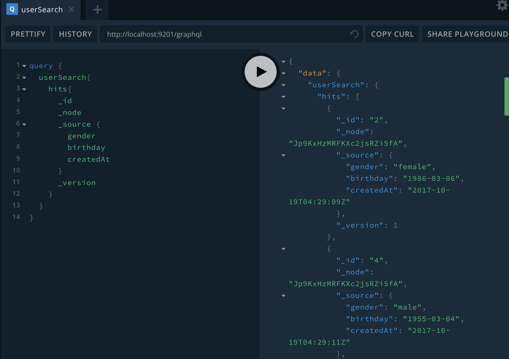

# graphql-compose-elasticsearch demo

## How to Run

```code
docker-compose up -d
```

## Search Result

* search query

```code
query {
  userSearch{
    hits{
      _id
      _node
      _source {
        gender
        birthday
        createdAt
      }
      _version
    }
  }
}
```

* some image

